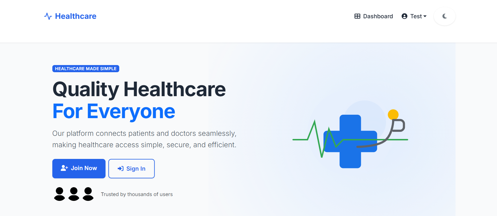
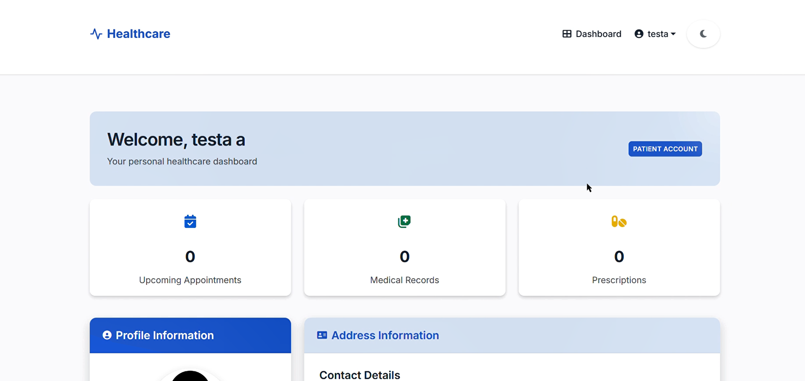
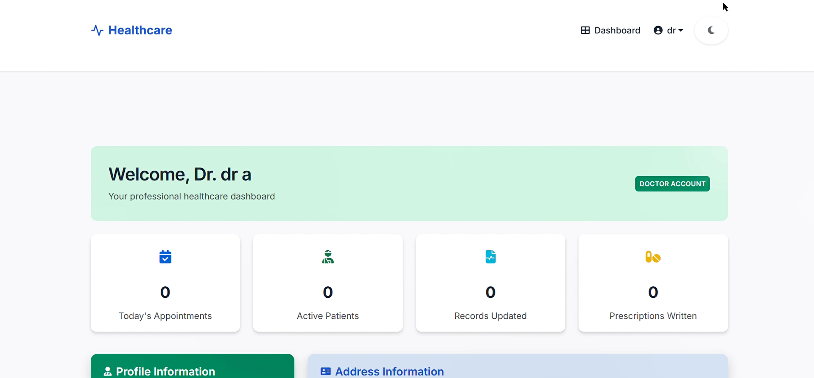

# Healthcare System

A Django-based healthcare platform that enables signup and login for different types of users (Patients and Doctors). Upon login, users are redirected to their respective dashboards.

## Features

- User registration for Patients and Doctors
- Secure authentication system
- Custom user profiles with profile pictures
- Separate dashboards for different user types
- Responsive design with modern UI
- Dark mode support

## Screenshots

### Welcome Page


### Patient Dashboard


### Doctor Dashboard


## Technologies Used

- Django 5.2.3
- Python 3.x
- HTML/CSS
- Bootstrap 5
- JavaScript
- SQLite (development)

## Setup Instructions

### Prerequisites

- Python 3.8 or higher
- pip (Python package manager)

### Installation

1. Clone the repository
   ```bash
   git clone https://github.com/yourusername/python_banao_1_github_repo.git
   cd python_banao_1_github_repo
   ```

2. Create a virtual environment
   ```bash
   python -m venv venv
   ```

3. Activate the virtual environment
   - On Windows:
     ```bash
     venv\Scripts\activate
     ```
   - On macOS/Linux:
     ```bash
     source venv/bin/activate
     ```

4. Install dependencies
   ```bash
   pip install -r requirements.txt
   ```

5. Create a `.env` file in the project root with the following content:
   ```
   DJANGO_SECRET_KEY=your_secret_key
   DJANGO_DEBUG=True
   DJANGO_ALLOWED_HOSTS=127.0.0.1,localhost
   ```

6. Apply migrations
   ```bash
   python manage.py migrate
   ```

7. Create a superuser (admin)
   ```bash
   python manage.py createsuperuser
   ```

8. Run the development server
   ```bash
   python manage.py runserver
   ```

9. Access the application in your browser at `http://127.0.0.1:8000/`

## Project Structure

- `dashboard/` - Dashboard app for different user types
- `healthcare_project/` - Main project settings
- `media/` - User-uploaded files
- `static/` - Static assets (CSS, JS, images)
- `templates/` - HTML templates
- `users/` - Custom user authentication app

## Task Requirements

1. Types of Users:
   - Patient
   - Doctor

2. Signup form with the following fields:
   - First Name
   - Last Name
   - Profile Picture
   - Username
   - Email Id
   - Password
   - Confirm Password
   - Address (line1, city, state, pincode)

3. Password validation to ensure password and confirm password fields match

4. Dashboards displaying user details from signup

## Contributing

1. Fork the repository
2. Create your feature branch (`git checkout -b feature/amazing-feature`)
3. Commit your changes (`git commit -m 'Add some amazing feature'`)
4. Push to the branch (`git push origin feature/amazing-feature`)
5. Open a Pull Request

## License

This project is licensed under the MIT License - see the LICENSE file for details.

## Acknowledgments

- Django documentation
- Bootstrap documentation
- Python Banao course instructors 